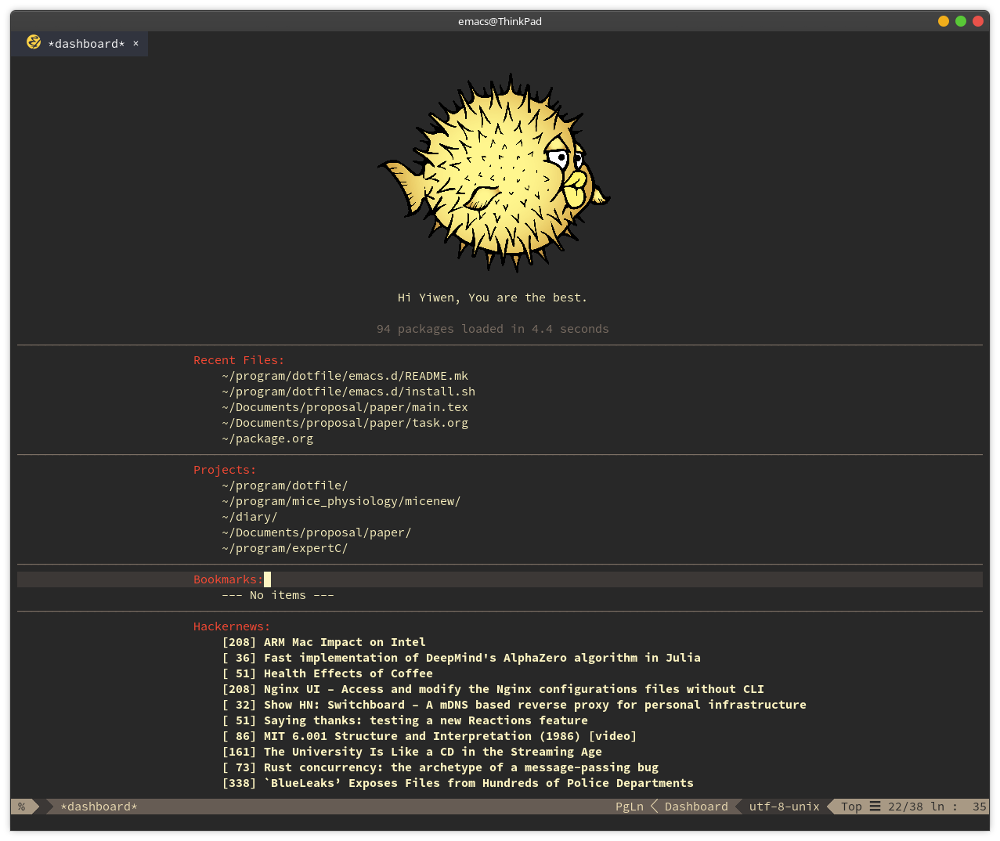

# Install Guide



To install the configuration, you only need to run this command.
```bash
	sh ./install.sh
```
This command will backup your original configuration and then copy the configuration automatically to destination.

Note that, the back file will have a ".bak" suffix.